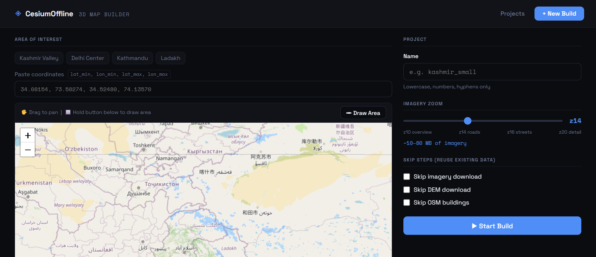
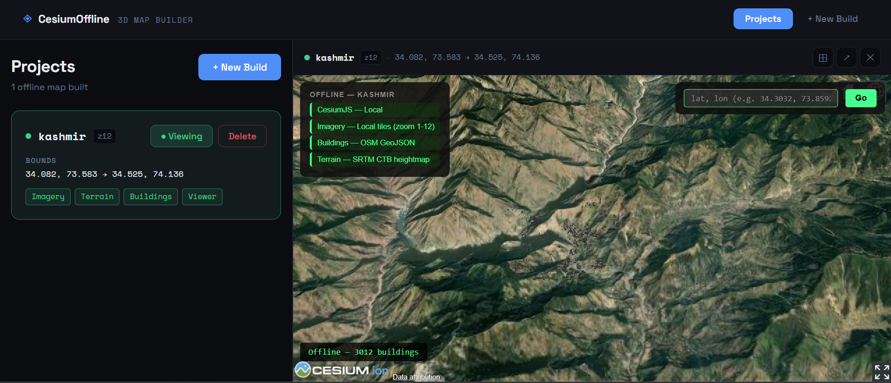

# CesiumOffline

Build a **fully offline** Cesium 3D map viewer from just a bounding box.  
One command downloads satellite imagery, elevation data, and OSM buildings — then serves a local 3D viewer with terrain and buildings, no internet required.

---

## Screenshots

> Projects dashboard with embedded 3D viewer



> New Build panel — draw AOI on map or paste coordinates



---

## Features

- **FastAPI REST API** — trigger builds, poll progress, manage projects via `/docs` Swagger UI
- **React UI** — draw bounding box on map, monitor live build progress, launch viewer
- **Satellite imagery** — Google Maps tiles, zoom 1–20, 32 parallel workers
- **DEM elevation** — SRTM1 from AWS skadi (30m resolution)
- **OSM buildings** — OpenStreetMap footprints with height data via Overpass API
- **Terrain tiles** — Cesium Terrain Builder (CTB) via Docker
- **Fully offline viewer** — CesiumJS with terrain, satellite imagery, and 3D buildings

---

## API

| Method | Endpoint | Description |
|--------|----------|-------------|
| `GET` | `/api/health` | Health check |
| `GET` | `/api/projects` | List all projects |
| `POST` | `/api/projects` | Start a new build |
| `GET` | `/api/projects/{name}/status` | Poll build progress |
| `DELETE` | `/api/projects/{name}` | Delete a project |

Interactive docs at `http://localhost:8000/docs`

### Example

```bash
curl -X POST http://localhost:8000/api/projects \
  -H "Content-Type: application/json" \
  -d '{
    "name": "kashmir",
    "lat_min": 34.08154,
    "lon_min": 73.58274,
    "lat_max": 34.52480,
    "lon_max": 74.13570,
    "max_zoom": 16
  }'
```

---

## Requirements

| Tool | Install |
|------|---------|
| Python 3.8+ | — |
| Node.js | `sudo apt install nodejs` |
| GDAL | `sudo apt install gdal-bin` |
| Docker | `sudo apt install docker.io` |
| CTB image | `docker pull homme/cesium-terrain-builder` |

---

## Quick Start

```bash
pip3 install -r requirements.txt
cd frontend && npm install && npm run build && cd ..
python3 serve.py
# Open http://localhost:8000
```

### CLI (original interface)

```bash
python3 run.py --bounds "34.08154,73.58274,34.52480,74.13570" --name kashmir
```

---

## Project Structure

```
cesium_offline/
├── api/main.py          ← FastAPI app
├── frontend/src/        ← React UI
├── scripts/             ← Pipeline: imagery, DEM, buildings, terrain
├── run.py               ← CLI interface
├── serve.py             ← Starts FastAPI + serves built frontend
└── requirements.txt
```

---

## License

MIT
